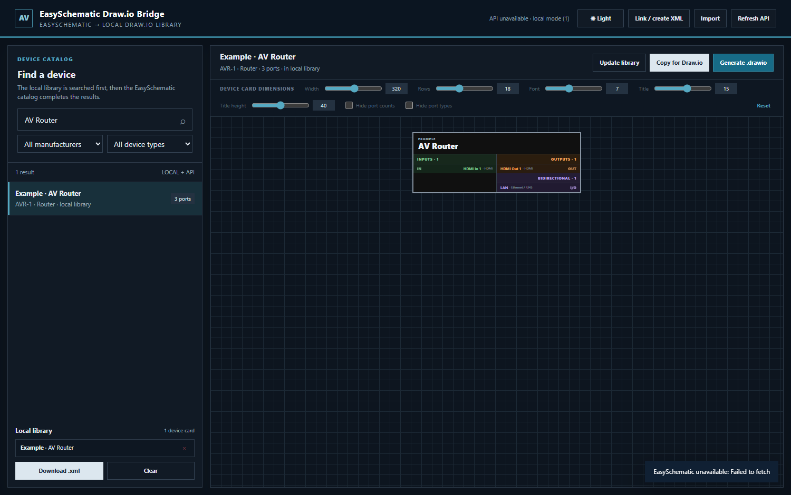

# EasySchematic Draw.io Bridge

A standalone browser tool that turns [EasySchematic](https://easyschematic.live/) device templates into compact, routable device cards for [Draw.io](https://www.drawio.com/).

Each generated input, output, and bidirectional row is a real Draw.io connection target. The complete card still moves as a single unit.



## Features

- Search the EasySchematic device catalog by manufacturer, model, or part number.
- Keep previously used devices in an offline local library.
- Copy a native `mxGraphModel` directly to the clipboard and paste it into Draw.io.
- Export individual `.drawio` files or a reusable Draw.io `.xml` shape library.
- Import libraries previously created by the application.
- Adjust card width, port-row height, label font, title font, and title-row height.
- Optionally hide port counts or visible signal/connector details.
- Preserve signal and connector metadata even when those details are hidden.
- Use persistent light and dark interface themes.
- Run entirely in the browser with no application server or build step.

## Quick start

1. Open `index.html` in a recent Chromium-based browser such as Chrome or Edge.
2. Search for a device and select it.
3. Adjust the device card dimensions and visible details.
4. Select **Copy for Draw.io**.
5. Switch to Draw.io Desktop or the web editor and press `Ctrl+V` (`Cmd+V` on macOS).

The pasted card is a container. Move it by selecting its outer border. Connect cables directly to the colored `IN`, `OUT`, or `I/O` rows.

## Local library workflow

Selecting **Add to library** stores the normalized device and its current display settings in browser storage.

- **Download .xml** exports every saved card as a Draw.io custom library.
- **Import** restores a compatible library or a JSON device collection.
- **Link / create XML** uses the File System Access API, when supported, to update a chosen library file after cards are generated.

Draw.io does not automatically reload a changed custom-library file. Direct clipboard copy is usually the fastest workflow for one-off cards.

## Browser storage and privacy

The application has no backend. Device definitions, display preferences, cached catalog data, and an optional linked-file handle are stored locally through `localStorage` and IndexedDB.

The only network request made by the application is to the public EasySchematic templates endpoint:

```text
https://api.easyschematic.live/templates
```

If the endpoint is unavailable or blocked by browser policy, saved and imported local-library devices remain usable.

## Compatibility

- Chrome and Edge provide the complete experience, including linked-file support.
- Other modern browsers can use search, preview, clipboard, import, and download features, but may not support direct file linking.
- Very narrow cards intentionally truncate long labels. A width of 240 or more is recommended for detailed technical documentation.

## Development

There is no dependency installation or compilation step. Edit `index.html`, open it locally, and reload the browser.

Before publishing a change, verify at least:

- light and dark themes;
- minimum and maximum card dimensions;
- direct paste into Draw.io;
- `.drawio` export;
- library export and re-import;
- offline fallback with an imported library.

## Project status

The project is intentionally small and dependency-free. Feature requests and focused pull requests are welcome; large framework migrations should demonstrate a clear user benefit.

## Independence and trademarks

EasySchematic Draw.io Bridge is an independent community project. It is not affiliated with or endorsed by EasySchematic, JGraph Ltd, or diagrams.net. EasySchematic, Draw.io, diagrams.net, and related names remain the property of their respective owners.

## License

Released under the [MIT License](LICENSE).

